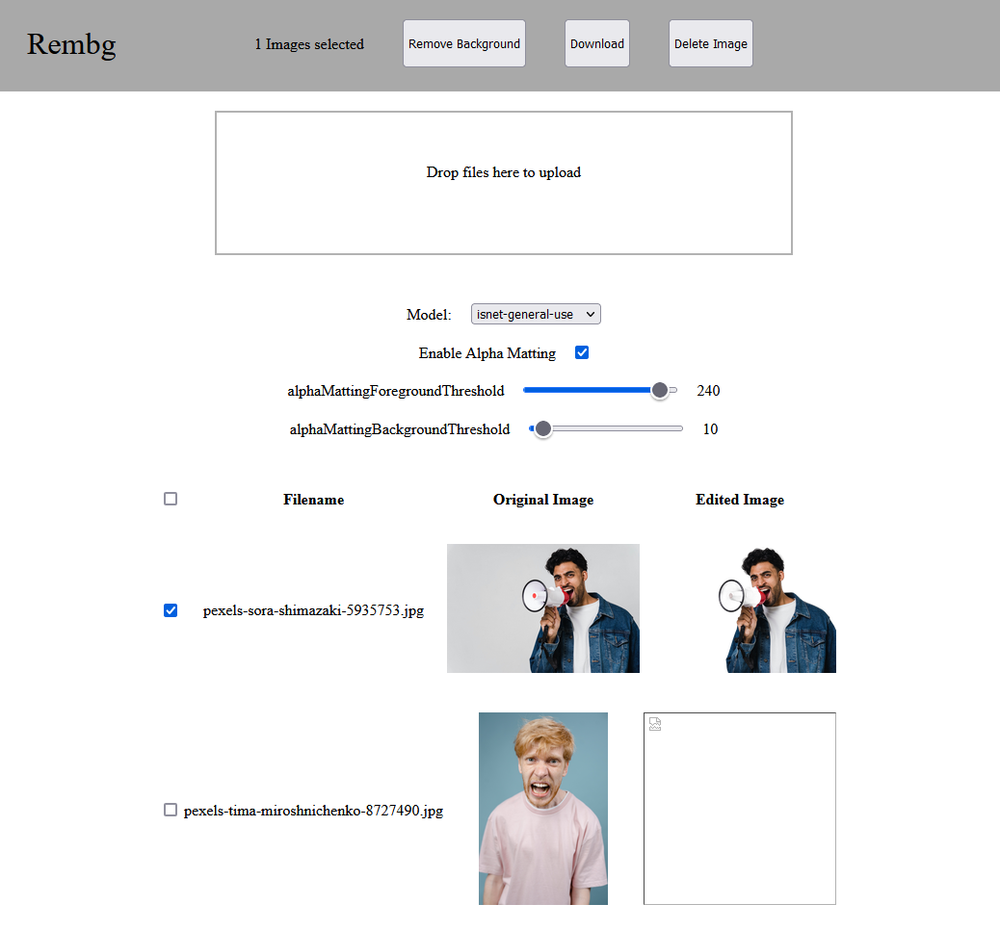

# Frontend for Rembg
This is frontend for the [rembg](https://github.com/danielgatis/rembg) python library to remove the background from images.

Written in Python using Flask, some HTML, CSS and Javascript.

# Install
Tested on Python 3.11

```pip install rembg flask```

# Usage
Start with ```flask --app main run```

navigate in a browser to http://localhost:5000

---
